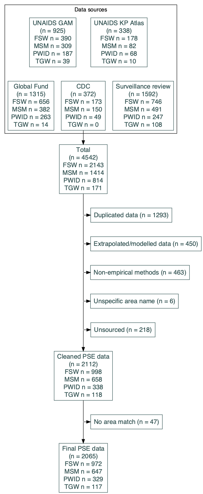
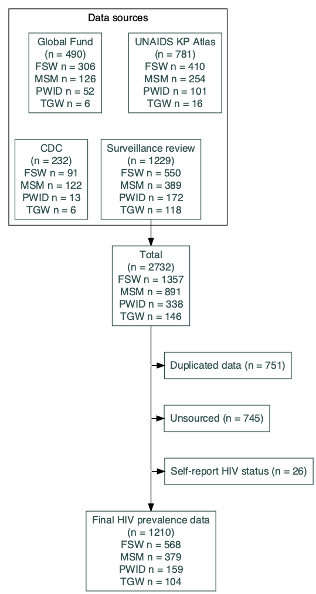

```{r setup, include=FALSE}
knitr::opts_chunk$set(echo = TRUE)
library(tidyverse)
library(DiagrammeR)
library(countrycode)
library(knitr)
library(sf)

region <- read.csv("R objects for report/region.csv") %>%
  mutate(iso3 = toupper(iso3))

ssa_names <- c("Angola", "Botswana", "Eswatini", "Ethiopia", "Kenya", "Lesotho",  "Malawi", "Mozambique", "Namibia", "Rwanda", "South Africa", "South Sudan", "Uganda", "United Republic of Tanzania", "Zambia", "Zimbabwe", "Benin", "Burkina Faso", "Burundi", "Cameroon", "Central African Republic", "Chad", "Congo", "Côte d'Ivoire", "Democratic Republic of the Congo", "Equatorial Guinea", "Gabon", "Gambia", "Ghana", "Guinea", "Guinea-Bissau", "Liberia", "Mali", "Niger", "Nigeria", "Senegal", "Sierra Leone", "Togo")
ssa_iso3 <- countrycode(ssa_names, "country.name", "iso3c")

group_proportion <- function(df, variables) {
  df %>%
    dplyr::group_by(across(all_of(variables))) %>%
    dplyr::summarise(n = n()) %>%
    dplyr::mutate(prop = n/sum(n))
}

```

## Background

Female sex workers (FSW), men who have sex with men (MSM), people who inject drugs (PWID), and transgender people (TG) experience disproportionate risk of HIV acquisition and transmission in sub-Saharan Africa (SSA) [1]. Delivering appropriate HIV prevention and treatment programming for these key populations requires estimates of population size, HIV prevalence, and new HIV infections.

Key population surveillance relies on methods underpinned by respondent-driven or network sampling. Surveillance methods to quantify total population HIV burden, for example national household surveys or antenatal clinic data, are unsuitable for key population surveillance due to population size, high mobility or homelessness, non-disclosure of key population status, and societal marginalisation that often excludes key populations from relevant sampling frames. Key population surveillance is often restricted to or disproportionately conducted in urban areas and studies are conducted infrequently. As are result, data are sparse with limited representativeness.

Few countries have longitudinal estimates of population size or HIV prevalence for key populations, and any longitudinal estimates are largely restricted to female sex workers [2]. Where longitudinal estimates exist, they are often noisy or inconsistent due to small sample sizes and convenience sampling methods. Most countries lack data for transgender populations.

Systematic reviews and meta-analyses of population size, HIV prevalence data, or ART coverage that encompass all countries in SSA have been conducted for FSW, MSM, and PWID. Region-level studies are most available for FSW, including of HIV prevalence and the treatment cascade [3], [4]; Stannah et al. produced estimates of the testing and treatment cascade in MSM [5]; and Degenhardt and colleagues conducted systematic reviews in 2007 and 2017 for PWID highlighting both the paucity of PWID surveillance data in SSA and, from the limited data available, increasing prevalence of injecting drug use and HIV prevalence within PWID [6], [7]. The Global.HIV group has developed a database detailing a range of epidemiological, behavioural, and legal indicators for key populations up to 2017, including for transgender people [8], [9]. Whilst several recent studies on transgender populations have been published [10]--[13], insufficient data exist to conduct region-level metaanalyses.

Efforts to consolidate key population surveillance data have also been undertaken by a range of international stakeholders, including the Joint United Nations Program on HIV/AIDS (UNAIDS), the US Centers for Disease Control and Prevention (CDC), the U.S. President's Emergency Plan for AIDS Relief (PEPFAR), and the Global Fund to Fight AIDS, TB, and Malaria (GF) as part of monitoring the state of the epidemic, evaluating programmes, assessing data availability, and to make recommendations on key population data reporting and quality thresholds [14]--[19].

We consolidated and harmonised key population size estimate, HIV prevalence, and ART coverage data from multiple existing databases. We described the availability of data across countries and over time for each key population group and characterised the relationship between key population and total population HIV indicators. We used regression analysis to extrapolate and smooth national level estimates of key population size, HIV prevalence, and ART coverage for all countries in SSA.

## Data

Population size estimate (PSE), HIV prevalence, and ART coverage data were extracted from:

-   UNAIDS Global AIDS Monitoring

-   UNAIDS Key Population Atlas

-   Global Fund surveillance database

-   CDC key population database 

Data were excluded from analysis if:

-   Data were duplicated across or within databases; or

-   Information about key population definition, year, or surveillance area were missing; or

-   The surveillance area was non-specific (e.g. 'urban areas' or '5 provinces'); or

-   Estimates were modelled or extrapolated; or

-   Data were severe outliers; or

-   Data could not be confirmed by primary source review

Countries in Eastern and Southern Africa (ESA) were defined as: Angola, Botswana, Eswatini, Ethiopia, Kenya, Lesotho, Malawi, Mozambique, Namibia, Rwanda, South Africa, South Sudan, Tanzania, Uganda, Zambia, Zimbabwe

Countres in Western and Central Africa (WCA) were defined as: Benin, Burkina Faso, Burundi, Cameroon, Central African Republic, Chad, Congo - Brazzaville, Congo - Kinshasa, Côte d'Ivoire, Equatorial Guinea, Gabon, Gambia, Ghana, Guinea, Guinea-Bissau, Liberia, Mali, Niger, Nigeria, Senegal, Sierra Leone, Togo

\newpage
\blandscape

```{r echo=FALSE, out.width='50%', fig.show="hold", fig.cap = "Data workflow for population size estimate data (left) and HIV prevalence data (right)"}




```

\newpage

```{r echo=FALSE, out.width='50%', fig.show="hold", fig.cap = "Data workflow for ART coverage data", fig.align="center"}


```

\elandscape
# Methods

## 3.1 Transforming population size data

Population size estimates reported as counts were converted to population proportion to facilitate comparison of population sizes across settings. Two sources were used to derive total population denominators:

1.  Naomi: Naomi is a small-area estimation model used to estimate subnational HIV epidemic indicators for the total population [20]. District-level total populations were extracted by five-year age group and sex for 2020. These populations were projected back in time using the national population trajectory from Spectrum/DemProj [21], [22].

2.  GRUMP & WorldPop: The Global Rural/Urban Mapping Project [23] provided geographic boundaries for urban areas in 1995. These urban boundaries were overlaid on constrained WorldPop population rasters for 2020 [24] to produce estimates of total population for all urban areas in 2020. Urban areas were snapped to their closest district. The district age/sex structure and population growth over time was used to create longitudinal estimates of age/sex stratified population from 2000-2020

```{r echo=FALSE, fig.cap = "Total population denominators used for converting key population size estimates to population proportions"}

data.frame("Key population" = c("FSW", "MSM", "PWID", "TG"),
           "Population denominator" = c("15-49 female",
                                        "15-49 male",
                                        "15-49 both sexes",
                                        "15-49 female")) %>%
  knitr::kable()

```

Each population size estimate was matched to the total population denominator for a given age, sex, year, and area. Age information was missing from nearly all key population data entries; missing data was assigned ages 15-49. Unless a sex was specified, all sex workers were assumed to be female, all PWID assumed to be both sexes, and all transgender people assumed to be female. String matching was used to assign one of a Naomi area name or GRUMP area name to each surveillance area, thereby matching to a total population denominator.

## 3.2 Transforming HIV prevalence data and ART coverage data

To facilitate cross-country comparison, key population HIV prevalence and ART coverage data were expressed relative to total population estimates for a given age, sex, year, and first administrative level (henceforth 'province').

Age information was available for more HIV prevalence and ART coverage data entries than for population size (UNAIDS GAM age groups of \<25 and 25+ were often used, and assigned ages 15-24 and 25-49 respectively). Unless a sex was specified, all sex workers were assumed to be female, all PWID assumed to be both sexes, and all transgender people assumed to be female.

Cross-sectional estimates of age/sex-specific HIV prevalence and ART coverage at the province level were extracted from Naomi for 2020. For each country, province level estimates were projected back in time 2000-2020 parallel to the EPP/Spectrum [25] 15-49 national HIV prevalence and ART coverage trajectories respectively.

## 3.3 Regression models

### 3.3.1 Population size

We modelled national key population proportions with a spatial smoothing model allowing population proportions to be correlated between geographically neighbouring countries. Logit population proportion for each key population was assumed to be normally distributed. $\mu$ is decomposed into a model intercept, $\beta_0$, and a spatial smoothing component at the national level, $\theta$ for $i \in 1,2, ... 38$, given an intrinsic conditional autoregressive (ICAR) prior:

$$ logit(p_i) \sim N(\mu_i, \sigma) $$ $$\mu_i = \beta_0 + \theta_i $$

### 3.3.2 HIV prevalence

We modelled the relationship between key population HIV prevalence and total population HIV prevalence (age 15-49 years) separately for each key population.

The number of key population members living with HIV, $Y$, is assumed to be binomially distributed with the probability of testing positive given by $p$. Logit $p$ varies linearly with total population HIV prevalence, $\rho$, for a given age group, $a$, year, $t$, and province, $x$:

$$ Y_{a,t,x} \sim \text{Binom}(n, p_{a,t,x})$$ $$ p_{a,t,x} \sim \text{Beta}(?,?)$$ $$ logit(p_{a,t,x}) = \beta_0 + \beta_1 logit(\rho_{a,t,x})$$

### 3.3.3 ART coverage

We modelled key population ART coverage as a function of total population ART coverage, analogously to HIV prevalence. Logit-transformed key population ART coverage is assumed to follow a betabinomial distribution against logit total population coverage.

The number of key population members on ART, $X$, is assumed to be binomially distributed with the probability of being on treatment, $p$. $p$ varies linearly with matched total population coverage, $\alpha$, for a given age group, $a$, year, $t$, and province, $x$:

$$ X_{a,t,x} \sim \text{Binom}(n, p_{a,t,x})$$ $$ p_{a,t,x} \sim \text{Beta}(?,?)$$ $$ logit(p_{a,t,x}) = \beta_0 + \beta_1 logit(\alpha_{a,t,x})$$

# 4. Results

Table X shows a summary of the deduplicated PSE, HIV prevalence, and ART coverage data.


```{r include=FALSE}

pse_input_count_text <- readRDS("R objects for report/PSE/pse_input_count_text.rds") %>%
  mutate(across(c("FSW", "MSM", "PWID", "TG"), ~str_remove(.x, "FSW|MSM|PWID|TG")),
         across(c("FSW", "MSM", "PWID", "TG"), ~str_trim(.x))
  )
pse_final <- read_csv("~/Imperial College London/HIV Inference Group - WP - Documents/Analytical datasets/key-populations/PSE/pse_final.csv")

pse_method <- pse_final %>%
  distinct(country.name, ref, year, kp, method) %>%
  mutate(year = plyr::round_any(year, 3),
         year = paste0(year, "-", year+2)) %>%
  count(country.name, ref, method, year, kp)

empirical_proportion <- pse_final %>%
  mutate(year = plyr::round_any(year, 3),
         year = paste0(year, "-", year+2)) %>%
  filter(year %in% c("2013-2015", "2019-2021"), !is.na(method)) %>%
  distinct(year, country.name, ref, year, kp, simple_method) %>%
  count(simple_method, year) %>%
  group_by(year) %>%
  mutate(prop = round(100*n/sum(n))) %>%
  filter(simple_method == "empirical")

study_n_2012 <- filter(pse_method, year == "2010-2012") %>% group_by(kp) %>% summarise(n=sum(n))
study_n_2021 <- filter(pse_method, year == "2019-2021") %>% group_by(kp) %>% summarise(n=sum(n))

msm_region_proportions <- pse_final %>%
  filter(kp == "MSM") %>%
  mutate(iso3 = countrycode::countrycode(country.name, "country.name", "iso3c")) %>%
  left_join(region) %>%
  mutate(under_1 = ifelse(population_proportion < 0.01, 1, 0)) %>%
  group_proportion(c("region", "under_1"))

```

## 4.1 Population size data

Estimates of key population size were extracted from:

-   UNAIDS Global AIDS Monitoring (FSW $`r pse_input_count_text[1,3]`$; MSM $`r pse_input_count_text[1,4]`$; PWID $`r pse_input_count_text[1,5]`$; TG $`r pse_input_count_text[1,6]`$); and

-   UNAIDS Key Population Atlas (FSW $`r pse_input_count_text[2,3]`$; MSM $`r pse_input_count_text[2,4]`$; PWID $`r pse_input_count_text[2,5]`$; TG $`r pse_input_count_text[2,6]`$); and

-   Global Fund surveillance database (FSW $`r pse_input_count_text[3,3]`$; MSM $`r pse_input_count_text[3,4]`$; PWID $`r pse_input_count_text[3,5]`$; TG $`r pse_input_count_text[3,6]`$); and

-   CDC key population database (FSW $`r pse_input_count_text[4,3]`$; MSM $`r pse_input_count_text[4,4]`$; PWID $`r pse_input_count_text[4,5]`$; TG $`r pse_input_count_text[4,6]`$); and

-   KP surveillance reports (FSW $`r pse_input_count_text[5,3]`$; MSM $`r pse_input_count_text[5,4]`$; PWID $`r pse_input_count_text[5,5]`$; TG $`r pse_input_count_text[5,6]`$);

Following data cleaning, primary source review, and area matching, $`r nrow(pse_final)`$ data entries for population size were extracted from $`r length(unique(pse_final$ref))`$ studies. Data were most available for FSW (n=$`r nrow(filter(pse_final, kp == "FSW"))`$), followed by MSM (n=$`r nrow(filter(pse_final, kp == "MSM"))`$), PWID (n=$`r nrow(filter(pse_final, kp == "PWID"))`$), and TG (n=$`r nrow(filter(pse_final, kp == "TG"))`$). Size estimation methods were available for $`r round(nrow(filter(pse_final, !is.na(method)))/nrow(pse_final)*100)`$% of data ($`r nrow(filter(pse_final, !is.na(method)))`$/$`r nrow(pse_final)`$). Since 2010-12, studies estimating key population size in SSA are being conducted more frequently. In 2019-21, $`r study_n_2021$n[study_n_2021$kp == "FSW"]`$ FSW, $`r study_n_2021$n[study_n_2021$kp == "MSM"]`$ MSM, $`r study_n_2021$n[study_n_2021$kp == "PWID"]`$ PWID and XX TG PSE studies were recorded, increasing from $`r study_n_2012$n[study_n_2012$kp == "FSW"]`$, $`r study_n_2012$n[study_n_2012$kp == "MSM"]`$, $`r study_n_2012$n[study_n_2012$kp == "PWID"]`$, and 0 in 2010-12 respectively. The use of empirical methods (Two and three source capture-recapture (2S and 3S-CRC), multiplier methods, and SS-PSE) is also increasing from $`r filter(empirical_proportion, year == "2013-2015")$prop`$% in 2013-2015 to $`r filter(empirical_proportion, year == "2019-2021")$prop`$% in 2019-2021.

``` {r echo=FALSE, message=FALSE, warning =FALSE, fig.width = 9, out.width = "75%", fig.align = "center"}

pse_method %>%
  group_by(year, kp) %>%
  summarise(n = sum(n)) %>%
  ggplot(aes(x=year, y=n, fill=kp)) +
    geom_col() +
    moz.utils::standard_theme() +
    labs(x=element_blank(), y="Number of studies", fill = element_blank()) +
    scale_fill_manual(values = wesanderson::wes_palette("Zissou1")[c(1,2,3,5)])

```

```{r echo=FALSE, fig.width = 14, fig.height = 6, out.wdth = "100%", fig.align = "center"}

pse_method %>%
  filter(!is.na(method)) %>%
  count(method, kp, year) %>%
  mutate(method = factor(method,
                         levels= c("3S-CRC", "SS-PSE", "2S-CRC", "Object/event multiplier", "Multiple methods - empirical", "Service multiplier", "PLACE/Mapping", "Multiple methods - mixture"))) %>%
  ggplot(aes(x=year, y=n, fill=method)) +
  geom_col(position = "fill") +
  scale_fill_manual(values = rev(c('#deebf7','#c6dbef','#9ecae1','#6baed6','#4292c6','#2171b5','#08519c','#08306b'))) +
  scale_y_continuous(labels = scales::label_percent()) +
  facet_wrap(~kp, nrow=1) +
  moz.utils::standard_theme() +
  labs(x=element_blank(), y=element_blank(), fill=element_blank()) +
  theme(panel.background = element_rect(fill=NA, colour="black"),
        axis.text.x = element_text(angle = 20, hjust = 1))

```

Of $`r nrow(filter(pse_final, kp == "MSM"))`$ MSM population proportions, $`r nrow(filter(pse_final, kp == "MSM", population_proportion < 0.01))`$ ($`r round(100*nrow(filter(pse_final, kp == "MSM", population_proportion < 0.01))/nrow(filter(pse_final, kp == "MSM")))`$%) were below 1% ($`r filter(msm_region_proportions, region=="ESA", under_1 == 1)$n`$/$`r sum(filter(msm_region_proportions, region=="ESA")$n)`$; $`r round(100*filter(msm_region_proportions, region=="ESA", under_1 == 1)$prop)`$% in ESA and $`r filter(msm_region_proportions, region=="WCA", under_1 == 1)$n`$/$`r sum(filter(msm_region_proportions, region=="WCA")$n)`$; $`r round(100*filter(msm_region_proportions, region=="WCA", under_1 == 1)$prop)`$% in WCA)

``` {r echo=FALSE, warning = FALSE, message = FALSE, fig.width = 4.5, fig.height = 5, out.height = "35%", fig.align = "center", fig.cap = "MSM population size estimate proportions in ESA and WCA"}

pse_final %>%
  filter(kp == "MSM") %>%
  mutate(iso3 = countrycode::countrycode(country.name, "country.name", "iso3c")) %>%
  left_join(region) %>%
  ggplot(aes(x=region, y=population_proportion)) +
  geom_boxplot() +
  scale_y_continuous(labels = scales::label_percent(), limits = c(0,.1), breaks = c(0, 0.01, 0.025, 0.05, 0.075, 0.1)) +
  geom_hline(aes(yintercept = 0.01), color="red", linetype = 2, size=1) +
  moz.utils::standard_theme() +
  labs(x=element_blank(), y="MSM population proportion")

```

\newpage

## 4.2 HIV prevalence and ART coverage data

``` {r include = FALSE}

prev_input_count_text <- readRDS("R objects for report/Prevalence/prev_input_count_text.rds") %>%
  mutate(across(c("FSW", "MSM", "PWID", "TG"), ~str_remove(.x, "FSW|MSM|PWID|TG")),
         across(c("FSW", "MSM", "PWID", "TG"), ~str_trim(.x))
  )
prev_final <- read_csv("~/Imperial College London/HIV Inference Group - WP - Documents/Analytical datasets/key-populations/HIV prevalence/prev_final.csv")

prev_denom <- prev_final %>% 
  mutate(has_denominator = ifelse(!is.na(denominator), 1, 0)) %>% 
  group_proportion("has_denominator")

art_input_count_text <- readRDS("R objects for report/ART coverage/art_input_count_text.rds") %>%
  mutate(across(c("FSW", "MSM", "PWID", "TG"), ~str_remove(.x, "FSW|MSM|PWID|TG")),
         across(c("FSW", "MSM", "PWID", "TG"), ~str_trim(.x))
  )
art_final <- read_csv("~/Imperial College London/HIV Inference Group - WP - Documents/Analytical datasets/key-populations/ART coverage/art_final.csv")

art_denom <- art_final %>% 
  mutate(has_denominator = ifelse(!is.na(denominator), 1, 0)) %>% 
  group_proportion("has_denominator")


```


Estimates of key population HIV prevalence were extracted from:

-   UNAIDS Global AIDS Monitoring (FSW $`r prev_input_count_text[1,3]`$; MSM $`r prev_input_count_text[1,4]`$; PWID $`r prev_input_count_text[1,5]`$; TG $`r prev_input_count_text[1,6]`$); and

-   UNAIDS Key Population Atlas (FSW $`r prev_input_count_text[2,3]`$; MSM $`r prev_input_count_text[2,4]`$; PWID $`r prev_input_count_text[2,5]`$; TG $`r prev_input_count_text[2,6]`$); and

-   Global Fund surveillance database (FSW $`r prev_input_count_text[3,3]`$; MSM $`r prev_input_count_text[3,4]`$; PWID $`r prev_input_count_text[3,5]`$; TG $`r prev_input_count_text[3,6]`$); and

-   CDC key population database (FSW $`r prev_input_count_text[4,3]`$; MSM $`r prev_input_count_text[4,4]`$; PWID $`r prev_input_count_text[4,5]`$; TG $`r prev_input_count_text[4,6]`$); and

-   KP surveillance reports (FSW $`r prev_input_count_text[5,3]`$; MSM $`r prev_input_count_text[5,4]`$; PWID $`r prev_input_count_text[5,5]`$; TG $`r prev_input_count_text[5,6]`$);

Following data cleaning, primary source review, and area matching, $`r nrow(prev_final)`$ data entries for HIV prevalence were extracted from $`r distinct(prev_final, ref) %>% filter(!is.na(ref)) %>% nrow()`$ studies. Denominators were available for $`r round(100*prev_denom$prop[prev_denom$has_denominator == 1])`$% ($`r prev_denom$n[prev_denom$has_denominator == 1]`$/$`r sum(prev_denom$n)`$) of data entries. Data were most available for FSW (n=$`r nrow(filter(prev_final, kp == "FSW"))`$), followed by MSM (n=$`r nrow(filter(prev_final, kp == "MSM"))`$), PWID (n=$`r nrow(filter(prev_final, kp == "PWID"))`$), and TG (n=$`r nrow(filter(prev_final, kp == "TG"))`$). 

Estimates of key population ART coverage were extracted from:

-   UNAIDS Key Population Atlas (FSW $`r art_input_count_text[1,3]`$; MSM $`r art_input_count_text[1,4]`$; PWID $`r art_input_count_text[1,5]`$; TG $`r art_input_count_text[1,6]`$); and

-   Global Fund surveillance database (FSW $`r art_input_count_text[2,3]`$; MSM $`r art_input_count_text[2,4]`$; PWID $`r art_input_count_text[2,5]`$; TG $`r art_input_count_text[3,6]`$); and

-   KP surveillance reports (FSW $`r art_input_count_text[3,3]`$; MSM $`r art_input_count_text[3,4]`$; PWID $`r art_input_count_text[3,5]`$; TG $`r art_input_count_text[3,6]`$);

Following data cleaning, primary source review, and area matching, $`r nrow(art_final)`$ data entries for ART coverage were extracted from $`r distinct(art_final, ref) %>% filter(!is.na(ref)) %>% nrow()`$ studies. Denominators were available for $`r round(100*art_denom$prop[art_denom$has_denominator == 1])`$% ($`r art_denom$n[art_denom$has_denominator == 1]`$/$`r sum(art_denom$n)`$) of data entries. Data were most available for FSW (n=$`r nrow(filter(art_final, kp == "FSW"))`$), followed by MSM (n=$`r nrow(filter(art_final, kp == "MSM"))`$), PWID (n=$`r nrow(filter(art_final, kp == "PWID"))`$), and TG (n=$`r nrow(filter(art_final, kp == "TG"))`$). 

## 4.3 Population size estimates - modelled estimates

```{r include=FALSE}
pse_estimates <- read_csv("~/Imperial College London/HIV Inference Group - WP - Documents/Analytical datasets/key-populations/PSE/pse_estimates.csv")

pse_estimates <- pse_estimates %>%
  left_join(pse_final %>%
              mutate(iso3 = countrycode(country.name, "country.name", "iso3c")) %>%
              filter(iso3 != "LBR") %>%
              select(iso3, kp) %>%
              distinct() %>%
              mutate(has_data = 1)) %>%
  mutate(has_data = ifelse(is.na(has_data), 0, 1),
         has_data = factor(has_data, labels = c("No data", "Data")))

iso3_sort <- pse_estimates %>%
  distinct(iso3) %>%
  left_join(region) %>%
  arrange(four_region) %>%
  mutate(iso3_idx = as.numeric(fct_inorder(iso3)))

pse_estimates <- pse_estimates %>%
  left_join(iso3_sort) %>%
  mutate(xmin = iso3_idx - 0.48,
         xmax = iso3_idx + 0.48,
         background_col = ifelse(is.na(area_name), 1, 0))

pse_data_overlay <- pse_final %>%
  left_join(pse_estimates %>% select(iso3, iso3_idx) %>% distinct()) %>%
  left_join(region) %>%
  filter(iso3 != "LBR")

pse_iqr <- pse_estimates %>% 
  group_by(kp) %>%
  summarise(val = round(100*quantile(median, c(0.25, 0.5, 0.75)),2))

grey <- read_sf("R objects for report/Longitude_Graticules_and_World_Countries_Boundaries-shp/99bfd9e7-bb42-4728-87b5-07f8c8ac631c2020328-1-1vef4ev.lu5nk.shp") %>%
  filter(CNTRY_NAME %in% c("Western Sahara", "Mauritania", "Morocco", "Algeria", "Libya", "Tunisia", "Egypt", "Equatorial Guinea", "Somalia", "Djibouti", "Eritrea")) %>%
  bind_rows(read_sf("R objects for report/sdn_adm_cbs_nic_ssa_20200831_shp/sdn_admbnda_adm0_cbs_nic_ssa_20200831.shp")) %>%
  bind_rows(read_sf("R objects for report/ssd_admbnda_imwg_nbs_shp/ssd_admbnda_adm0_imwg_nbs_20180817.shp")) %>%
  st_crop(xmin=-180, xmax=180, ymin=-35, ymax=90)

geographies <- read_sf("R objects for report/Longitude_Graticules_and_World_Countries_Boundaries-shp/99bfd9e7-bb42-4728-87b5-07f8c8ac631c2020328-1-1vef4ev.lu5nk.shp") %>%
  bind_rows(read_sf("R objects for report/ssd_admbnda_imwg_nbs_shp/ssd_admbnda_adm0_imwg_nbs_20180817.shp") %>% mutate(CNTRY_NAME = "South Sudan")) %>%
  mutate(iso3 = countrycode(CNTRY_NAME, "country.name", "iso3c"),
         area_name = countrycode(iso3, "iso3c", "country.name")) %>%
  filter(iso3 %in% ssa_iso3)

geographies <- geographies %>%
  arrange(iso3) %>%
  mutate(id.iso3 = as.numeric(factor(iso3))) %>%
  select(iso3, area_name, id.iso3) %>%
  st_make_valid()

```

Population size estimates were estimated at the national level for 38 countries in sub-Saharan Africa for FSW, MSM, and PWID. Data were insufficient to estimate transgender population proportions. Medians of national PSE proportions among adults 15-49 across SSA were:

-   $`r pse_iqr[2,2]`$% of women were female sex workers (IQR $`r pse_iqr[1,2]`$-$`r pse_iqr[3,2]`$%);
-   $`r pse_iqr[5,2]`$% of men have sex with men (IQR $`r pse_iqr[4,2]`$-$`r pse_iqr[6,2]`$%);
-   $`r pse_iqr[8,2]`$% of adults injected drugs (IQR $`r pse_iqr[7,2]`$-$`r pse_iqr[9,2]`$%)

Regional variation in PSE: FSW similar, MSM +++ in ESA than WCA, PWID +++ in WCA than ESA (but dodgy congo data)

\newpage
\blandscape

```{r echo=FALSE, out.width="100%", warning = FALSE, message = FALSE, fig.cap = "Estimated population size estimates for FSW, MSM, and PWID expressed as a proportion of sex-matched 15-49 adult total population", fig.width = 14, fig.height = 10}

pal <- wesanderson::wes_palette("Zissou1", 100, type = "continuous")

pse_maps <- lapply(c("FSW", "MSM", "PWID"), function(x) {
  
  pse_estimates %>%
    filter(kp == x) %>%
    left_join(geographies) %>%
    ggplot() +
    geom_sf(data = grey, aes(geometry = geometry), fill="darkgrey") +
    geom_sf(aes(geometry = geometry, fill=median)) +
    moz.utils::standard_theme() +
    # viridis::scale_fill_viridis(labels = scales::label_percent()) +
    scale_fill_gradientn(colours = pal, labels = scales::label_percent()) +
    labs(fill = "PSE proportion", title = x) +
    coord_sf(datum = NA) +
    theme(legend.key.width = unit(1.5, "cm"),
          plot.title = element_text(hjust = 0.5, face = "bold", size=16))
  
})

ggpubr::ggarrange(pse_maps[[1]], pse_maps[[2]], pse_maps[[3]], nrow=1)

```

\newpage

```{r echo=FALSE, warning = FALSE, message = FALSE, fig.cap = "Estimated key population proportions in FSW, MSM, and PWID. Countries where modelled estimates were informed by local surveillance data are shown in blue, and countries informed by spatial smoothing alone are shown in yellow.", out.width = "100%", fig.width = 16, fig.height = 10}

pse_estimates %>%
  ggplot() +
    geom_jitter(data = pse_data_overlay %>% filter(!kp %in% c("TG", "TGW", "SW"), population_proportion < 1, population_proportion != 0), 
                aes(x=iso3_idx, y=population_proportion), alpha = 0.2, width = 0.4) +
    geom_segment(aes(x = xmin, xend = xmax, y = median, yend = median, color=has_data), size=1) +
    geom_rect(aes(xmin = xmin, xmax = xmax, ymin = lower, ymax = upper, fill=has_data), alpha=0.3, show.legend = FALSE) +
    geom_hline(data = data.frame(yintercept = 0.01, kp = "MSM", iso3 = c("AGO", "ZWE")), linetype = 3, aes(yintercept = yintercept), color="red") +
    scale_color_manual(values = c(wesanderson::wes_palette("Zissou1")[c(4,1)])) +
    scale_fill_manual(values = wesanderson::wes_palette("Zissou1")[c(4,1)])  +
    scale_x_continuous(breaks = 1:38, labels = iso3_sort$iso3) +
    facet_grid(kp ~ four_region, scales="free", space="free_x") +
    scale_y_log10(breaks = scales::log_breaks(), labels = scales::label_percent(accuracy = 0.001)) +
    labs(x=element_blank(), y="Population proportion", color = "Informed by:", shape = "Data reported\nas national") +
    moz.utils::standard_theme() +
    theme(axis.text.x = element_text(size=10),
          panel.background = element_rect(fill=NA, color="black"))

```

\elandscape

## 4.4 HIV prevalence - modelled estimates

Figure X shows estimates for key population HIV prevalence as estimated on the logit scale (left) and on the natural prevalence scale (right). Prevalence among FSW and PWID are positively correlated ($R^2$ = 0.20 and 0.43 respectively) and higher than matched total population HIV prevalence. At 1% total population prevalence, FSW prevalence is 17fold higher, and PWID prevalence is 7fold higher, and at 30% total population prevalence 1.6fold and 1.4fold respectively. Estimates of HIV prevalence in PWID at high total population prevalences are poorly informed by data. Prevalence among MSM was poorly with total population prevalence ($R^2$ = 0.02). The average estimated HIV prevalence among MSM was around 20% and did not vary with total population HIV prevalence, but the observed range was large from less than 1% to over 60%.

```{r echo=FALSE, warning = FALSE, message = FALSE, fig.cap = "Estimated key population prevalence as a function of total population prevalence on the estimated logit scale (left) and natural scale (right)", fig.height = 12, fig.width = 10, out.width = "100%", out.height = "90%"}

prev_estimates <- read_csv("~/Imperial College London/HIV Inference Group - WP - Documents/Analytical datasets/key-populations/HIV prevalence/prev_estimates.csv")

convert_logis_labels <- function(x) {
  paste0(round(plogis(x)*100, 1), "%")
}

p1 <- prev_estimates %>%
  bind_rows() %>%
  filter(model == "betabinomial") %>%
  ggplot(aes(x=qlogis(provincial_value), y=logit_fit)) +
  geom_line(size=1) +
  geom_ribbon(aes(ymin = logit_lower, ymax = logit_upper), alpha=0.3) +
  geom_point(data = prev_final %>% 
               filter(kp %in% c("MSM", "PWID", "FSW")) %>%
               left_join(region), 
             aes(y=qlogis(value), color=region), alpha = 0.3) +
  geom_abline(aes(intercept = 0, slope=1), linetype = 3) +
  moz.utils::standard_theme() +
  scale_y_continuous(labels = convert_logis_labels) +
  scale_x_continuous(labels = convert_logis_labels) +
  labs(y = "KP HIV prevalence", x = "Age/sex matched total\npopulation HIV prevalence")+
  theme(panel.border = element_rect(fill=NA, color="black")) +
  facet_wrap(~kp, ncol=1)

p2 <- prev_estimates %>%
  bind_rows() %>%
  filter(model == "betabinomial") %>%
  ggplot(aes(x=provincial_value, y=fit)) +
  geom_line(size=1) +
  geom_ribbon(aes(ymin = lower, ymax = upper), alpha=0.3) +
  geom_point(data = prev_final %>% 
               filter(kp %in% c("MSM", "PWID", "FSW")) %>%
               left_join(region), 
             aes(y=value, color=region), alpha = 0.3) +
  geom_abline(aes(intercept = 0, slope=1), linetype = 3) +
  moz.utils::standard_theme() +
  scale_x_continuous(labels = scales::label_percent(accuracy = 1), limits = c(0,0.5)) +
  scale_y_continuous(labels = scales::label_percent(), limits = c(0,1)) +
  labs(y = "KP HIV prevalence", x = "Age/sex matched total\npopulation HIV prevalence")+
  theme(panel.border = element_rect(fill=NA, color="black")) +
  facet_wrap(~kp, ncol=1)

ggpubr::ggarrange(p1, p2, nrow=1, common.legend = TRUE, legend = "bottom")
```

## 4.5 ART coverage

```{r echo=FALSE, warning = FALSE, message = FALSE, fig.cap = "Estimated key population ART coverage as a function of total population ART coverage on the estimated logit scale (left) and natural scale (right)", fig.height = 12, fig.width = 10, out.width = "100%", out.height = "90%"}

art_estimates <- read_csv("~/Imperial College London/HIV Inference Group - WP - Documents/Analytical datasets/key-populations/ART coverage/art_estimates.csv")

convert_logis_labels <- function(x) {
  paste0(round(plogis(x)*100, 1), "%")
}

p1 <- art_estimates %>%
  bind_rows() %>%
  filter(model == "betabinomial") %>%
  ggplot(aes(x=qlogis(provincial_value), y=logit_fit)) +
  geom_line(size=1) +
  geom_ribbon(aes(ymin = logit_lower, ymax = logit_upper), alpha=0.3) +
  geom_point(data = art_final %>% 
               filter(kp %in% c("MSM", "PWID", "FSW")) %>%
               left_join(region), 
             aes(y=qlogis(value), color=region), alpha = 0.3) +
  geom_abline(aes(intercept = 0, slope=1), linetype = 3) +
  moz.utils::standard_theme() +
  scale_y_continuous(labels = convert_logis_labels) +
  scale_x_continuous(labels = convert_logis_labels) +
  labs(y = "KP ART coverage", x = "Age/sex matched total\npopulation ART coverage")+
  theme(panel.border = element_rect(fill=NA, color="black")) +
  facet_wrap(~kp, ncol=1)

p2 <- art_estimates %>%
  bind_rows() %>%
  filter(model == "betabinomial") %>%
  ggplot(aes(x=provincial_value, y=fit)) +
  geom_line(size=1) +
  geom_ribbon(aes(ymin = lower, ymax = upper), alpha=0.3) +
  geom_point(data = art_final %>% 
               filter(kp %in% c("MSM", "PWID", "FSW")) %>%
               left_join(region), 
             aes(y=value, color=region), alpha = 0.3) +
  geom_abline(aes(intercept = 0, slope=1), linetype = 3) +
  moz.utils::standard_theme() +
  scale_x_continuous(labels = scales::label_percent(accuracy = 1), limits = c(0.25,1)) +
  scale_y_continuous(labels = scales::label_percent(), limits = c(0.25,1)) +
  labs(y = "KP ART coverage", x = "Age/sex matched total\npopulation HIV prevalence")+
  theme(panel.border = element_rect(fill=NA, color="black")) +
  facet_wrap(~kp, ncol=1)

ggpubr::ggarrange(p1, p2, nrow=1, common.legend = TRUE, legend = "bottom")
```

Figure X shows estimates of key population ART coverage against age/sex matched total population ART coverage as estimated on the logit scale (left) and on the natural prevalence scale (right). Median ART coverage in FSW and MSM is strongly correlated with total population ART coverage ($R^2$ = X and X respectively). < Review 2007 and 2010 NGA PWID data > 

# 5. Discussion

We consolidated and deduplicated key population data from several independently curated databases, validated them against primary source material, and analysed the data to estimate national-level key population size, HIV prevalence, and ART coverage for female sex workers, men who have sex with men, and people who inject drugs in sub-Saharan Africa. 

National-level key population estimates may be used to guide National Strategic Planning and are of use to international donor programmes. In countries lacking any surveillance data, these model-based estimates provide a foundation on which to base programmatic decisions and highlight opportunities for future surveillance exercises. However, the use of national-level estimates should not be used at the expense of locally-derived estimates which may be more appropriate for targeting and evaluating HIV prevention and treatment programmes. Further, surveillance data informing these estimates were collected exclusively in urban areas or rural KP hotspots (e.g. on trucking routes or near mining sites) and their application to rural populations should be carefully considered. 

Surveillance data for transgender people available for this analysis were insufficient to estimate robustly population size, HIV prevalence, or ART coverage at the national level. In some surveillance exercises, transgender people were enumerated and tested for HIV, but their sample sizes deemed too small to report, or are omitted as transgender surveillance was not a primary objective [26]. Retrospective review of surveillance reports and the recovery of these data would assist in estimation for transgender people. 

PSE data were available for the majority of countries for FSW and MSM. Model-based estimates for these populations are well informed by local data in each country, and heterogeneity in modelled estimates across countries is driven by variation in the data. Uncertainty was, appropriately, larger for countries that did not have data. FSW estimates and regional differences are in line with those reported by Laga et al. who estimated higher population proportions in ESA than WCA, and lower FSW proportion in South Africa than its immediate neighbours [27]. Data on PWID population size were sparser, particularly in Southern Africa countries, which is concerning given their HIV burden. Guided by less data, PWID PSE model estimates were more homogeneous than PSE estimates for FSW and MSM with large uncertainty ranges. Given the data sparsity of data about PWID size estimates, modelled point estimates may not reflect the true population sizes in many settings, and size estimates for programme planning will benefit from triangulation with programmatic data and expert knowledge in each setting. 

Fifty-six percent of MSM PSE datapoints and 79% of national-level modelled MSM estimates from this analysis are below 1% of the matched 15-49 male population which UNAIDS and WHO recommend be revised [15]. Data and estimates under 1% are not restricted to older estimates. Since 2016, 30% (3/10) of PSEs designated ‘nationally adequate’ by UNAIDS and 80% (114/143) of datapoints collected were under 1% of the adult male population. Consideration should be given to (1) the methods used to generate small population proportion estimates and (2) the use of the recommended minimum threshold. Programmatic mapping was used to extrapolate surveillance estimates to generate XX of the 114 recent population proportions below 1%, including datapoints from Nigeria, Cameroon, and Kenya. This extrapolation depends on provision of KP-focused services in the areas to which estimates are extrapolated.  The methodological quality of these estimates should be closely reviewed. The 1% recommended proportion is a useful tool to guide the review of MSM population proportions. Its use, however, as a minimum threshold is difficult to reconcile with the distribution of available PSE data, particularly when newly conducted surveillance using the best available empirical methods produce smaller population proportions than the 1% threshold. 

Estimates of HIV prevalence in FSW and PWID were correlated with matched total population prevalence. While FSW HIV prevalence data were available from across sub-Saharan Africa and therefore over a range of total population HIV prevalence, PWID data were sparse in Southern Africa and limited to total population prevalence below 5%. Additional PWID data from high prevalence settings would strengthen the findings from this analysis. 

The majority of MSM HIV prevalence observations exceeded the matched total population HIV prevalence, as also reported by Hessou et al. [28]. However, while total population prevalence predicted FSW and PWID HIV prevalence, it did not predict MSM prevalence. HIV transmission among MSM may be more decoupled from total population dynamics. Both FSW and PWID have sexual contact with the total population. Whilst bisexuality is common in SSA and female partners of MSM can act as ‘bridging populations’ between MSM and the total population [29]–[31], MSM sexual networks remain more likely to be inward facing. Early epidemic phylogenetic data from South Africa indicated that subtype B predominated in white MSM, whilst subtype C was most common in black heterosexual men [32]. Though subtype segregation in South Africa has blurred over time [33], phylogenetic sequencing in Senegal and Togo suggest dense sexual networks with efficient transmission between MSM, distinct to total population and FSW networks [29], [34]. Further covariates should be explored to produce credible estimates of MSM HIV prevalence.

Across all three key populations, at low total population ART coverage key population coverage is beneath that of matched total population coverage, whilst at high total population ART coverage key population coverage exceeds it. Datapoints at low total population ART coverage are from WCA and those at high ART coverage from ESA. Regional age patterns, turnover, and risk behaviour initiation dynamics may drive this difference. Data from West Africa indicate women usually acquire HIV following initiation of sex work, reflecting low HIV prevalence in the total population, whilst in South Africa HIV infection in FSW often occurs before initiation of sex work [35]. As the probability of being on ART is positively correlated with age and time since seroconversion, we may expect recent seroconverters to have ART coverage beneath that of the matched total population, whilst older, professional sex workers in hyperendemic countries are likely to have high ART coverage. 

Future surveillance studies should prioritise estimates for transgender people throughout the region and PWID in Southern Africa. Estimates for all KPs would benefit from rural estimates, without which national-level estimates extrapolated from urban surveillance activities are uncertain. The inclusion of routine key population data from testing and treatment programmes would provide data with large sample sizes, permit longitudinal analyses over time, and inform estimates in rural areas. However, these data are challenging to include within model-based estimates. Key population programmes are most often provided in areas with the highest perceived need, leading to spatially biased data, the data are difficult to deduplicate, and it is challenging to verify key population status.

Several limitations should be considered in the interpretation of these estimates.Firstly, population proportions were derived from population size estimate counts, population denominators, and urban boundaries. The Global Rural/Urban Mapping Project boundaries date from 1995 [23]. Their application will underestimate urban size and population, and consequently overestimate population proportions. Second, sample size was omitted from the majority of data entries and all size estimates were equally weighted within the model. In some cases, sample sizes or standard error estimates could be recovered with further review of primary sources. Third, data entries with the country name as the surveillance area are treated as nationally representative and the national matched population used as the denominator. This will lead to underestimated population proportions if the data are only representative of a subnational area. Fourth, insufficient data exist to estimate trends in population proportions over time and this analysis treats all data as cross-sectional at a single timepoint. Fifth, few data points have methodological information accompanying them and data generated by non-empirical methods (e.g. wisdom of the crowds or expert opinion) will have been used in model calibration. <<HIV prevalence and ART coverage>>
